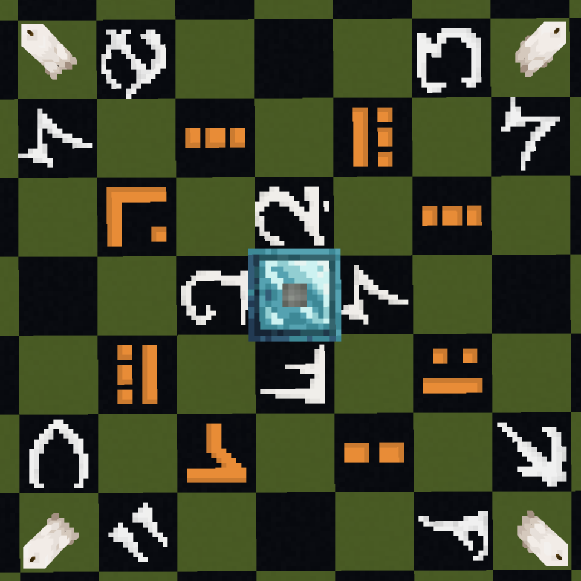

> An integration between the Create mod and Occultism.

## Main Features

### Spiritfire Automation

Place a Spiritfire or Spirit Campfire in front of an Encased Fan to automate the process!

### Ritual Automation

Automate any ritual (which doesn't require a sacrifice or external item use) using the Mechanical Chamber.

The Mechanical Arm is the best way to insert books into the Mechanical Chamber, and it uses the items in Sacrificial
Bowls
around it as usual.

### Crushing Automation

Automate crushing into dust using the Mechanical Pulverizer. This can be used in place of Occultism's crushing entities,
to automate all the dusts.

### Otherworld Detector

The otherworld detector outputs a Redstone signal if the nearest player to them has the otherworld vision
(either the goggles or the third eye potion effect).

Take a comparator output from it to get the distance to the nearest player with the otherworld vision!

### Spirit Solution

Crafted by either mixing Demon's Dream Fruit with water while heated, or crushing Demon's Dream Seeds,
Spirit Solution is used to bind books instead of crafting with a Dictionary of Spirits. In the future, it will
be used for other useful things.

## Partially Developed Features

These features are considered partially developed, because there is some functionality but they aren't feature complete,
and don't necessarily have any logical progression.

### New Rituals

Copper, Zinc and Brass chalk can be crafted and drawn on the ground like Occultism's regular chalk,
and is used for new rituals.

#### Fionntán's Uncompromising Captivation

This is the Ritual currently used only to craft the Otherworld Detector.

### New Spirits

#### The Púca

The Púca is a new spirit to add to the 4 existing base spirits. In the future it will be used for Create mod helper
entities
much like the lumberjacks of the Occultism mod.

## Future Plans

- Add a way to replace the sacrifices of a ritual with something more easily automated
- Complete documentation for the pentacles and the mod, using a combination of Modonomicon and Create's Ponder.