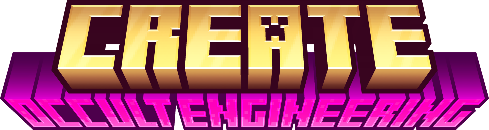

> Uma integração entre o mod Create e o Occultism.

Este README também está disponível nos seguintes idiomas:
- [English](./README.md)
- [Español (España)](./README.es_es.md)
- [Français (France)](./README.fr_fr.md)
- [Gaeilge](./README.ga_IE.md)
- [Русский](./README.ru_ru.md)
- [简体中文](./README.zh_cn.md)

# Links
- [Discord](https://discord.gg/B7Sd3eaTrs)
- [CurseForge](https://www.curseforge.com/minecraft/mc-mods/create-occult-engineering)
- [Modrinth](https://modrinth.com/mod/occult-engineering)
- [GitHub](https://github.com/irishgreencitrus/OccultEngineering)
- [Changelog Completo](https://github.com/irishgreencitrus/OccultEngineering/blob/main/CHANGELOG.md)
- [Crowdin](https://crowdin.com/project/occult-engineering)

# Sobre
Create: Occult Engineering é um mod que integra o Create com o Occultism, permitindo automatizar
rituais ocultos e atividades de outro mundo.

# Chamada para Tradutores!
Infelizmente, não sou abençoado com as habilidades para traduzir este mod para todos os idiomas, então preciso da sua ajuda!

Todo o texto neste mod é pré-traduzido via IA, mas se você encontrar algo que soe estranho, fique à vontade para contribuir no Crowdin!

# Primeiros Passos
Comece criando uma Enciclopédia de Almas a partir de um Dicionário de Espíritos e uma Engrenagem.

O restante pode ser descoberto dentro do livro ou lendo as receitas no JEI.

Além disso, todas as “Máquinas Ocultas” estão documentadas pelo Ponder do Create.

A falta de documentação é considerada um bug, então reporte qualquer coisa que você não entender via Discord ou GitHub.

# Principais Funcionalidades

## Automação da Spiritfire

Coloque uma Spiritfire ou uma Fogueira Espiritual na frente de um Ventilador Encaixotado para automatizar o processo!

## Automação de Rituais

Automatize qualquer ritual (que não exija sacrifício ou uso de itens externos) usando a Câmara Mecânica.

O Braço Mecânico é a melhor forma de inserir livros na Câmara Mecânica, e ele usa os itens nas Tigelas Sacrificiais
ao redor dela como de costume.

## Automação de Trituração

Automatize a trituração em pó usando o Pulverizador Mecânico. Ele pode ser usado no lugar das entidades de trituração do Occultism,
para automatizar todos os pós.

## Phlogiports

Phlogiports podem ser usados para transferir pacotes sem fio com base em seus endereços. Para mais informações, use o sistema de ponder no jogo.

## Detector do Outro Mundo

O detector do outro mundo emite um sinal de Redstone se o jogador mais próximo possuir a visão do outro mundo
(seja pelos óculos ou pelo efeito de poção do terceiro olho).

Pegue uma saída de comparador dele para obter a distância até o jogador mais próximo com a visão do outro mundo!

## Solução Espiritual

Criada ao misturar Fruto do Sonho do Demônio com água enquanto aquecido, ou triturar Sementes do Sonho do Demônio,
a Solução Espiritual é usada para encadernar livros em vez de usar um Dicionário de Espíritos. No futuro, será
usada para outras coisas úteis.

# Versões Suportadas

Este mod segue as versões suportadas pelo Create, o que significa que atualmente é compatível com Minecraft 1.20.1 e 1.21.1.

A versão do Create deve ser >= 6.0.8.

# Paridade de Recursos

Eu tento manter tanto 1.20.1 quanto 1.21.1 com paridade de recursos, mas se eu esquecer algo, por favor reporte via Discord ou GitHub.

# Funcionalidades Parcialmente Desenvolvidas

Essas funcionalidades são consideradas parcialmente desenvolvidas, porque possuem alguma funcionalidade, mas não estão completas
e não necessariamente têm uma progressão lógica.

## Novos Rituais

Giz de Cobre, Zinco e Latão pode ser criado e desenhado no chão como o giz comum do Occultism,
e é usado para novos rituais.

## Novos Espíritos

### A Púca

A Púca é um novo espírito que se junta aos 4 espíritos básicos existentes. No futuro, será usada para entidades auxiliares
do mod Create, da mesma forma que os lenhadores do mod Occultism.

# Planos Futuros

Confira a [página de issues no GitHub](https://github.com/irishgreencitrus/OccultEngineering/issues) para ver as funcionalidades planejadas.

Tem alguma sugestão? Entre no Discord ou abra uma issue!

> Observação: meu idioma nativo é o inglês, então perdoe-me se eu precisar traduzir de um lado para o outro.

Normalmente sou bem responsivo e tentarei responder o mais rápido possível.